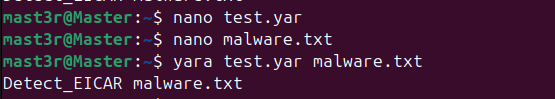

# 🦠 Daily Drill: YARA (Malware Pattern Matching)
**Date:** 2026-02-07

**Topic:** Static Analysis & Signature Creation

**Tools:** YARA, Linux Terminal

## 1. Concept: What is YARA?
YARA is the "Swiss Army knife" of malware research. Unlike Sysmon, which watches *behavior* (what a program does), YARA looks at *content* (what a file is). It searches for specific strings, hex patterns, or byte sequences inside files on disk.

## 2. The Setup
To simulate a malware detection scenario without handling dangerous code, I used the **EICAR Test File**. This is a harmless string that antivirus vendors agree to treat as a virus for testing purposes.

* **Installation:** `sudo apt install yara`
* **Malware Artifact:** Created `malware.txt` containing the EICAR string:
```bash
X5O!P%@AP[4\PZX54(P^)7CC)7}$EICAR-STANDARD-ANTIVIRUS-TEST-FILE!$H+H*
```
## 3. The Detection Rule
I wrote a YARA rule to scan for the specific ASCII string signature of the EICAR test file.

**File:** `detect_eicar.yar`
```yara
rule Detect_EICAR {
    meta:
        description = "Detects EICAR test file"
        author = "Mark Gitonga"
    strings:
        $a = "EICAR-STANDARD-ANTIVIRUS-TEST-FILE"
    condition:
        $a
}
```

## 4. Execution & Proof
I ran the YARA tool against the target file using the rule created above.

Command:

```Bash
yara detect_eicar.yar malware.txt
```
*Output:* As seen in the screenshot below, YARA successfully matched the rule Detect_EICAR against the file malware.txt.



## 🧠 Key Takeaway
YARA allows for Static Analysis. I don't need to run the malware (Dynamic Analysis) to know it's bad; I just need to recognize its "DNA" (strings/bytes). This is critical for scanning email attachments or uploaded files before they are executed.